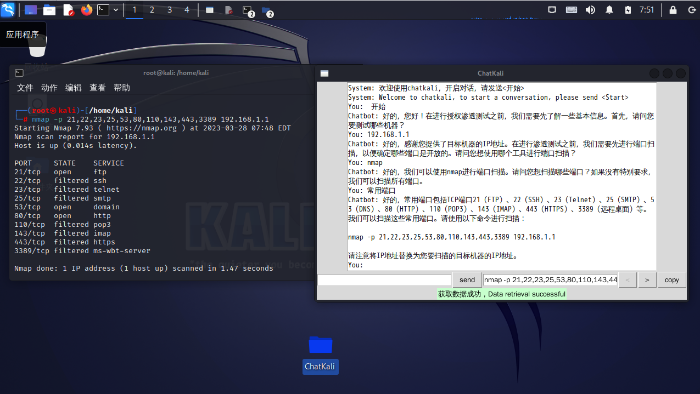

# ChatKali

  
  <h1 align="center">ChatKali</h1>
  
基于ChatGPT的kali Linux插件

  <a href="./README.md">English</a> |
  <a href="./README_CN.md">中文</a> 

## 安装

1. 克隆本仓库到您的本地计算机上。

   `git clone https://github.com/tzf1003/ChatKali.git`

2.  安装所需的Python模块。

   `pip install -r requirements.txt`

3. 修改config.ini文件内的api_key属性为您的key

   [Account API Keys - OpenAI API](https://platform.openai.com/account/api-keys)

4. 启动程序。

   `python main.py`

## 截图

  

## 使用方法

1. 运行程序后，会呈现出一个对话式界面。
2. 用户可以通过自然语言的命令和问题来与程序交互。
3. 程序会根据用户的输入提供指导，帮助用户使用Kali Linux完成某些任务。
4. 用户还可以询问关于特定工具或技术在渗透测试中的使用方法和指导。
5. 本程序旨在协助用户进行网络扫描、漏洞识别和利用等任务。

## 免责声明

本程序仅供授权使用。本程序的开发者不对使用本程序所造成的任何滥用或损害负责。

## 贡献

我们欢迎来自开源社区的贡献。请提交拉取请求或问题以报告任何错误或功能请求。

## 联系方式

如果您有关于本程序的任何问题或意见，请提交issue反馈。

## 常见问题解答

1. 本程序的目的是什么？ 

   本程序旨在协助用户使用Kali Linux在授权的机器上进行渗透测试，通过对话式界面提供指导。

2. 本程序如何工作？ 

   本程序利用ChatGPT这个强大的语言模型，解析用户的自然语言输入并提供指导，帮助用户使用Kali Linux完成某些任务。

3. 本程序是否合法？ 

   本程序仅供学习使用。本程序的开发者不对使用本程序所造成的任何滥用或损害负责。