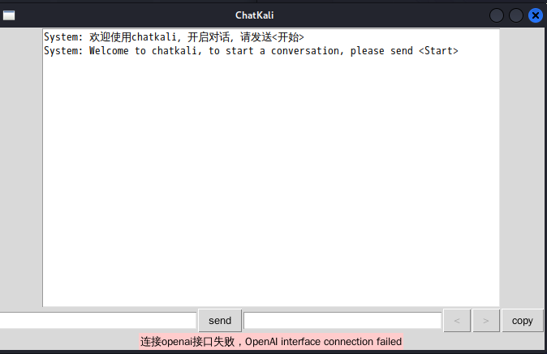
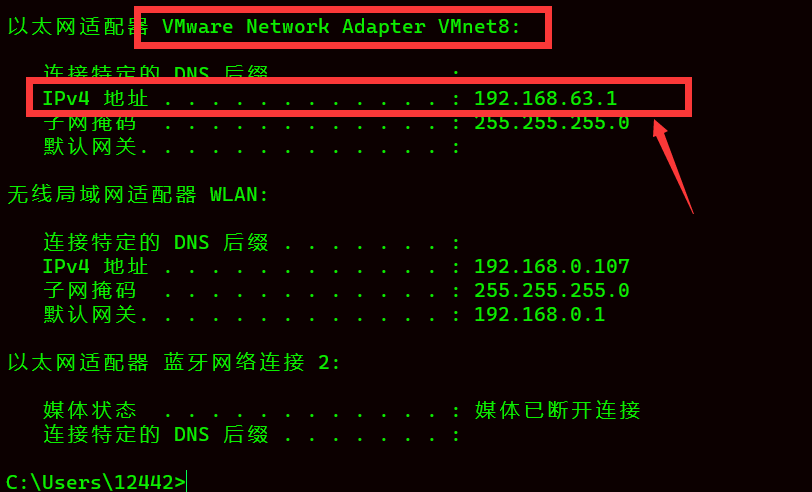

# 我的OpenAI接口被墙解决方案
### 错误提示
#### 连接openai接口失败：

## 解决方案(步骤)：
1. 首先确定物理机开启Clash正常访问https://platform.openai.com/（clash不会用的请自行google）

2. 首先在物理机上开启Clash的**允许局域网链接**，并获取**端口**

3. 在虚拟机→编辑→虚拟网络编辑器中**设置NAT网络**

4. 在 kali Linux 虚拟机设置中选择自定义，下拉框中**选择你刚才设置的网络**

5. 在物理机上输入ipconfig，**找到你刚才设置的网络，在物理机上的ip地址**。

6. 在kali linux虚拟机中，打开chatkali文件夹根目录，**编辑config.ini**文件 ，输入**ip:端口**，IP地址为第5步获取到的，端口为第2步获取到的，修改以后保存。

7. 重新运行 python main.py
